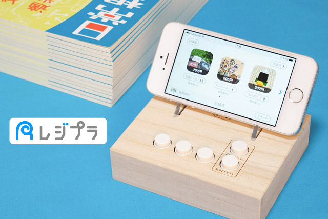
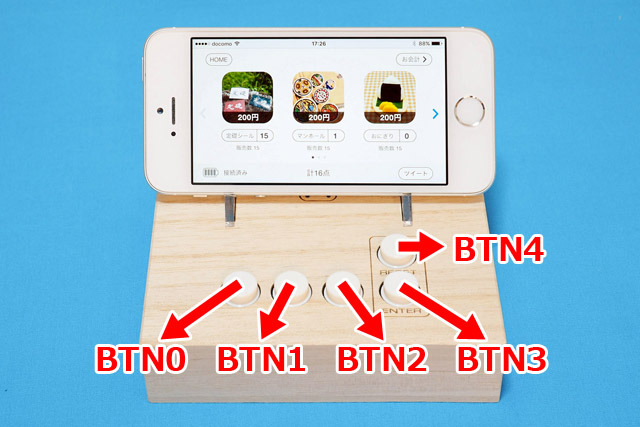
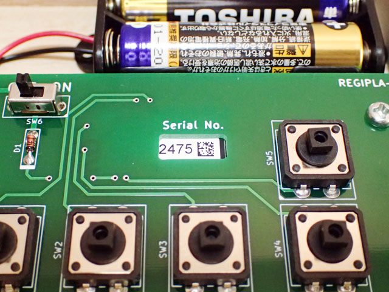
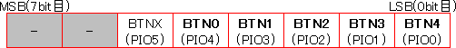
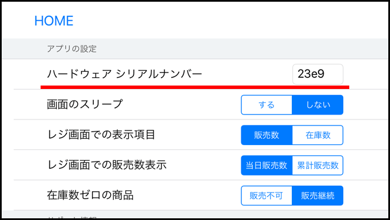

# レジプラ通信仕様書

本ドキュメントでは、即売会向けミニレジ「レジプラ」のBLE通信仕様を公開しています。

仕様をオープンにすることで、「レジプラ」を利用したアプリの開発を自由に行って頂くことを目的としています。これからは、煩わしいタップ操作にとらわれることなく、押しやすい物理ボタンを使った快適なアプリ操作が可能になるのです。

## レジプラとは

### 概要

「レジプラ」は、[TOKYO FLIP-FLOP](http://flip-flop.tokyo/)が開発した**即売会向けミニレジ**です。

物理ボタンを5つ搭載したシンプルな作りで、見た目にも味のある外装（桐箱製）が特徴。BLE（Bluetooth Low Energy）でスマホと接続することにより、レジプラ対応アプリの画面操作を物理ボタンで行うことができます。

現時点では、iOS用アプリ「[レジプラ - 即売会向けレジアプリ](https://itunes.apple.com/jp/app/rejipura-ji-mai-hui-xiangkerejiapuri/id1110792554)」との連携が可能です。物理ボタンの押しやすさを生かし、コミケなどの即売会の会計を強力にサポートします。

レジプラを使っている様子は、[Gigazineのレビュー記事](http://gigazine.net/news/20160720-regipla/)をご覧下さい。

### できること

元々はミニレジとして開発されたレジプラですが、**スマホ用の汎用物理ボタン**として、幅広い使い方が考えられます。

例えば、交通量調査のカウンターや、ボタンを使った音楽ゲームにも利用できます。スマホ以外にも、Raspberry Piとの連携も可能。

アプリ次第で、レジプラには無限の可能性が広がっているのです。

### 販売形態

ご自身で簡単なハンダ付けを行っていただく「組立キット」と、すぐに使える「完成品」を販売しています。現在、以下のオンラインストアで取扱中。

- 【組立キット】 [公式ストア](https://flipflop.booth.pm/items/286289) ・ [Amazon](https://www.amazon.co.jp/dp/B01L5FW3NK/)

- 【完成品】 [公式ストア](https://flipflop.booth.pm/items/286292)

[公式ストア](https://flipflop.booth.pm/)では、レジプラ以外にも「定礎シール」や「おっさん写植Tシャツ」など、愉快なグッズがいっぱいありますので、是非ついでにご覧下さい。これらの売上が、レジプラの開発費に充てられています。

レジプラについての最新情報は、[Twitter](https://twitter.com/tokyo_ff)や公式サイト [レジプラ.com](http://xn--yck2c9bj.com/) にてお知らせしています。

## アプリ開発方法

レジプラは、BLE準拠のペリフェラルデバイスとして動作します。ご自身のアプリ上で、BLEの通信を行うプログラムを書いて頂くことになります。

レジプラ用のライブラリなどは、現時点ではありません（要望が多ければ検討します）。各OSが提供するBLEのライブラリを用いて、以下に記載したプロトコルの実装をお願いします。

……と、若干ハードルは高いのですが、少し楽をする方法もあります。レジプラは、ユカイ工学が提供する「[konashi](http://konashi.ux-xu.com/documents/)」の仕様に似せて作ってありますので、konashiライブラリ（iOS用、Android用ともにあります）を少しいじるだけでそのまま利用できます。konashiとの差分については、あとでまとめて説明します。

## レジプラ物理仕様

### 諸元

- 通信モジュール： [koshian](http://www.m-pression.com/ja/solutions/boards/koshian)
- 通信方式： Bluetooth 4.1 Low Energy
- 入力I/F： プッシュボタン5個

### ボタン部

　

- ボタンは5個で、それぞれBTN0～BTN4とします
- プルアップ、アクティブ・ロー（通常時High、ボタン押下時Low）です
- それぞれ、koshianのPIOポート（[koshian仕様書](http://www.m-pression.com/ja/solutions/boards/koshian)を参照）に接続されています

koshian I/Fとの接続関係は以下の通りです。

|レジプラボタン|koshian I/F |
|:-------------|:-----------|
|BTN0          |PIO4        |
|BTN1          |PIO3        |
|BTN2          |PIO2        |
|BTN3          |PIO1        |
|BTN4          |PIO0        |

※ koshianのPIO5は基板上には出ていませんが、直接koshianにハンダ付けをすれば、汎用デジタル入出力ポートとして使用可能です。

## BLE仕様

Device Nameは、**regipla-＊＊＊＊** になっています。＊＊＊＊部分は4桁の16進数で、基板上のSerial No.と一致します。

　

### Services

|Name           |UUID                                |
|:--------------|:-----------------------------------|
|Regipla Service|C4C80000-3958-4A9E-8B40-9E8001469771|

※ このほか、FWアップデート用のサービス（Broadcom WICED-Smart-SDK準拠）があります。さわる場合は自己責任でお願いします。

### Characteristics

|Name                     |UUID                                 |
|:------------------------|:------------------------------------|
|PIO Setting              |C4C80001-3958-4A9E-8B40-9E8001469771 |
|PIO PullUp               |C4C80002-3958-4A9E-8B40-9E8001469771 |
|PIO Output               |C4C80003-3958-4A9E-8B40-9E8001469771 |
|PIO Input Notification   |C4C80004-3958-4A9E-8B40-9E8001469771 |
|Software Reset           |C4C80005-3958-4A9E-8B40-9E8001469771 |
|Low Battery Notification |C4C80006-3958-4A9E-8B40-9E8001469771 |
|LED Indicator Setting    |C4C80007-3958-4A9E-8B40-9E8001469771 |
|Timer Available          |C4C80008-3958-4A9E-8B40-9E8001469771 |

## Characteristics詳細

基本的には、"PIO Input Notification"（ボタン押下による通知）だけを使用すれば大丈夫です。その他のCharacteristicsは、特殊な使い方をする場合のオプションになります。

Read値、Write値は、以下のようにBTN0～BTN4を8bitに割り付けています。() 内は、対応するkoshianのポート名です。PIO5は基板上には出ていませんが設定可能で、koshianの端子に直にハンダ付けすると使用することも可能ですので、便宜上BTNXとします。

　

### PIO Setting

- Property: Read, Write Without Response
- BTN0～BTN4, BTNX のInput/Outputを切り替えます。
 - 0: Input
 - 1: Output
- 例えばBTN0をOutput、その他をInputに変更する場合は、0b00010000 をwriteします
- 起動時にはBTN0～4はInput、BTNXはOutputになっています
- 各ボタンを改造せずに使用する場合は、改めて設定する必要はありません

### PIO PullUp

- Property: Read, Write Without Response
- BTN0～BTN4, BTNX のプルアップを切り替えます。Inputポートにのみ有効です
 - 0: プルアップ無効
 - 1: プルアップ有効
- 例えばBTN1をプルアップ無効、その他をプルアップ有効に変更する場合は、0b00110111 をwriteします
- 起動時にはBTN0～4、BTNXはすべてプルアップ有効になっています
- 各ボタンを改造せずに使用する場合は、改めて設定する必要はありません

### PIO Output

- Property: Write Without Response
- BTN0～BTN4, BTNX の出力値を設定します。Outputポートにのみ有効です
 - 0: Low
 - 1: High
- 例えばBTN2の出力をHighにしたい場合は、0b00000100 をwriteします
- 各ボタンを改造せずに使用する場合は、特に設定の必要はありません

### PIO Input Notification

- Property: Read, Notify
- BTN0～BTN4, BTNX の値が変化したときにNotifyします
 - 0: Low
 - 1: High
- 両エッジで通知しますので、ボタンを押したときにも、離したときにも通知します
- 例えばBTN3を押したときには 0b00111101 が通知され、離したときには 0b00111111 が通知されます
- bit7、bit6は無効のため常に0です
- チャタリングにより、実際に押した回数以上の通知がきます。アプリ側でチャタリング除去処理を実装して下さい

### Software Reset

- Property: Write Without Response
- 8bitの値（なんでもいい）をwriteすると、ソフトウェアリセットがかかります
- 基本的に設定の必要はありません

### Low Battery Notification

- Property: Read, Notify
- バッテリ残量が10％未満 かつ いずれかのボタンを押した（PIO割込み発生）タイミングで、現在の電池残量値（0-9）を通知します
- 一度通知をすると、以降電源を入れ直すかソフトウェアリセットするまで、再度通知はしません

### LED Indicator Setting

- Property: Read, Write Without Response
- write値に応じて、各ポートのいずれかをインジケータLED用に割り当てます。Outputポートにのみ有効です
 - 0: BTN4 をインジケータLED用にする
 - 1: BTN3 をインジケータLED用にする
 - 2: BTN2 をインジケータLED用にする
 - 3: BTN1 をインジケータLED用にする
 - 4: BTN0 をインジケータLED用にする
 - 5: BTNX をインジケータLED用にする
- 有効設定したOutputポートにLEDを接続すると、BLE未接続時には点滅、BLE接続完了後は点灯するインジケータとなります
- 例えばBTN4をインジケータLED用にしたい場合は、0をwriteします
- 起動時にはBTNXがインジケータLED用になっています
- 各ボタンを改造せずに使用する場合は、特に設定の必要はありません

### Timer Available

- Property: Read, Write Without Response
- インジケータLEDの点滅（BLE未接続時の挙動）をON/OFFできます
 - 0: OFF
 - 1: ON
- 特に設定の必要はありません

## チャタリング対策

レジプラのボタンには、プッシュボタンの宿命であるチャタリングが発生します。

例えばBTN1を押し込んだときには、このように複数の "PIO Input Notification" が通知されます。

　0b00110111 
　0b00111111 
　0b00110111 
　0b00111111 
　0b00110111 
　（通知回数は押し具合によって異なります）

チャタリング対策はアプリ側で実施して下さい。レジプラ公式アプリでは、間隔が50ms以内の通知（PIO Input Notification）は無視する実装にしています。間隔の設定が短すぎるとチャタリングを防ぎきれず、逆に間隔を空けすぎるとボタンの連射が効かなくなります。

## 誤接続の防止策

即売会やフリマのイベント会場では、同じ室内に複数台のレジプラが存在している可能性があります。間違って他人のレジプラと接続できないよう、アプリ側でケアしていただくのが望ましいです。

レジプラ公式アプリでは、ユーザにシリアルナンバーを入力してもらう方式を採用しています。

　

[BLE仕様](#ble仕様)に記載の通り、シリアルナンバーは基板上に記載してあるユニークな番号であり、"Device Name" の末尾4文字となっています。ペリフェラルの検索後、"Device Name" にシリアルナンバーが含まれているレジプラに自動で接続します。つまり、シリアルナンバーの分からない他人のレジプラへは接続不可能となっています。

## バッテリ残量について

レジプラは、電源ラインに電圧降下0.6Vのダイオードを挿入しています。そのため "Battery Level" のRead値は、実際の電池残量よりも低めの値になっています。

組み立てキットとして販売するにあたり、万が一電源を逆接続した際にkoshianが破壊されるのを防ぐ目的で入れています。その辺を熟知されている方は、ダイオード部分をショートしてもらっても大丈夫です。

電源電圧と "Battery Level" 値との関係は次の通りです。

|レジプラ電源電圧[V]|電圧降下後の電圧[V]|Battery Level[%]|
|------------------:|------------------:|----------------:
|              3.80 |              3.20 |             100|
|              3.70 |              3.10 |              93|
|              3.60 |              3.00 |              86|
|              3.50 |              2.90 |              79|
|              3.40 |              2.80 |              71|
|              3.30 |              2.70 |              64|
|              3.20 |              2.60 |              57|
|              3.10 |              2.50 |              50|
|              3.00 |              2.40 |              43|
|              2.90 |              2.30 |              36|
|              2.80 |              2.20 |              29|
|              2.70 |              2.10 |              21|
|              2.60 |              2.00 |              14|
|              2.50 |              1.90 |               7|
|              2.40 |              1.80 |               0|

※ koshianの公称動作電圧 1.62V - 3.63V に対し、"Battery Level" は 1.8V - 3.2V のレンジを100%としています。

## konashiライブラリの利用

レジプラは、ユカイ工学が販売する「[konashi](http://konashi.ux-xu.com/documents/)」の仕様に似せて作ってあります。そのため、konashi用のライブラリが一部流用可能です。

使用できるのは、接続・切断・ハードウェア制御系（バッテリ残量取得、リセットなど）と、PIOの機能になります。AIO, PWM, UART, I2C に関するAPIは一切動きません（レジプラのファームウェアが対応していないため）。

使用に際しては、PIO関係のUUIDをレジプラ仕様に変更する必要があります（対応するCharacteristicsの名前を合わせてあります）。また、PIOのなかでも以下のAPIは正しく動作しない場合があります。

- pinMode
- pinPullup
- digitalRead
- digitalWrite

※ konashiライブラリ内部に関する質問には答えられない場合がありますのでご了承下さい。

## 連絡先

レジプラを使ったアプリを作られた方は、ぜひTOKYO FLIP-FLOPまでお知らせ下さい。Twitterやブログ等で告知させて頂きます。

技術的なお問い合わせもこちらまで。

- [お問い合わせフォーム](https://docs.google.com/forms/d/e/1FAIpQLSdsjOs3Xsf0jmz7rT8eoJsa7H9Lpi02qaLDTAjmOsht0I8lWA/viewform?c=0&w=1)

